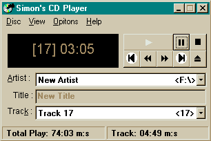



## Simon's CD Player v 1\.1 \(Updated\)

### Description

Introduction:

Simon' CD Player is a Microsoft Windows CD Player Clone. The CD playing functions are written using "mciSendString" (API only).

Please Vote and leave comments!
 
### More Info
 

             |
---                |---
**Submitted On**   |2001-09-28 18:30:24
**By**             |[Simon Kale](https://github.com/Planet-Source-Code/PSCIndex/blob/master/ByAuthor/simon-kale.md)
**Level**          |Beginner
**User Rating**    |5.0 (10 globes from 2 users)
**Compatibility**  |VB 6\.0
**Category**       |[Complete Applications](https://github.com/Planet-Source-Code/PSCIndex/blob/master/ByCategory/complete-applications__1-27.md)
**World**          |[Visual Basic](https://github.com/Planet-Source-Code/PSCIndex/blob/master/ByWorld/visual-basic.md)
**Archive File**   |[Simon's CD2711192820\.zip](https://github.com/Planet-Source-Code/simon-kale-simon-s-cd-player-v-1-1-updated__1-27613/archive/master.zip)

